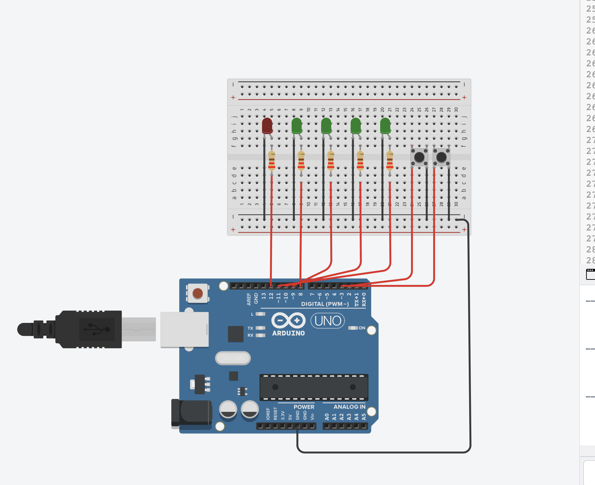
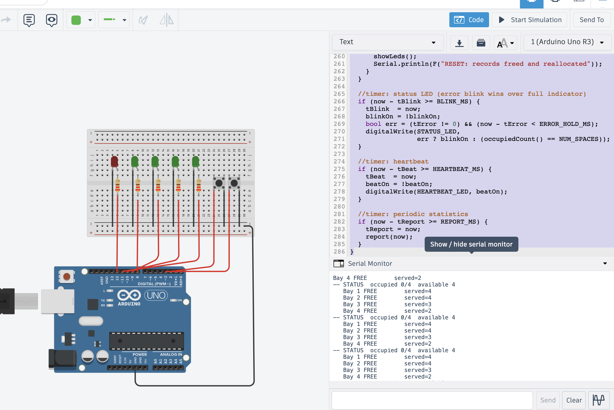
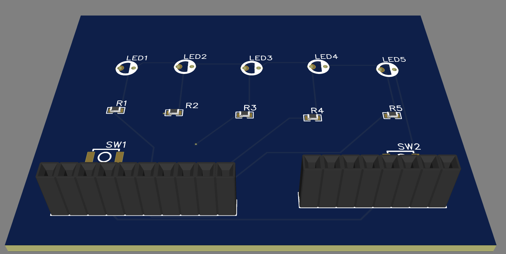

# Smart Parking Lot Monitoring System

An Arduino Uno project that watches four parking bays and shows whether each one is taken or free. A car arriving or leaving is simulated with two push buttons at the gate. It was built and simulated in Tinkercad, and the matching PCB (schematic and layout) was drawn in EasyEDA.

## How it works

Each bay is one LED. When a bay is occupied its LED is lit. Pressing the entry button parks a car in the first free bay, pressing the exit button releases the bay that has been parked longest. A separate status LED shows when the lot is full, and blinks quickly when an operation was rejected. The onboard LED on pin 13 blinks as a heartbeat so you can tell the loop is still running and never blocking.

All four bays are held in a small block of memory allocated at startup with `malloc`, and every bay is reached through a pointer into that block. Timing is done with `millis()` instead of `delay()`, so button presses, the LEDs, the heartbeat and the periodic report all run without ever stopping to wait.

## Hardware

| Pin      | Connected to                                  |
|----------|-----------------------------------------------|
| D2       | Entry button (INPUT_PULLUP, other leg to GND) |
| D3       | Exit button (INPUT_PULLUP, other leg to GND)  |
| D8 to D11| Bay 1 to Bay 4 LEDs, each with a 220R resistor|
| D12      | Status LED (solid = full, fast blink = error) |
| D13      | Heartbeat (onboard LED)                        |

## Tinkercad simulation

The breadboard build in Tinkercad, five LEDs (four bays plus the status LED) with resistors, two buttons, and the Arduino Uno.

## Serial Monitor output

The Serial Monitor prints a line after every accepted entry or exit, and a full status table on a timer showing how many bays are occupied, how many are available, and how many cars each bay has served over its lifetime.

## PCB in EasyEDA

The schematic and PCB layout were drawn in EasyEDA using the same parts: five LEDs (LED1 to LED5), five resistors (R1 to R5), the two buttons (SW1, SW2), and headers to bring the signals out to the Arduino.

## Error handling

- Trying to enter when all four bays are taken is rejected with a "LOT FULL" message, and the status LED blinks.
- Trying to exit when the lot is empty is rejected with a "LOT EMPTY" message.
- The occupied count is derived from the bay records, so it can never go above four or below zero.
- If memory cannot be allocated at startup the program reports it and stops safely instead of running with a bad pointer.
- Sending 'R' over serial frees the records and allocates them again, a simple reset.

## Files

- `smart_parking_monitor.ino` is the Arduino sketch.
- `images/` holds the Tinkercad, Serial Monitor and PCB screenshots.
